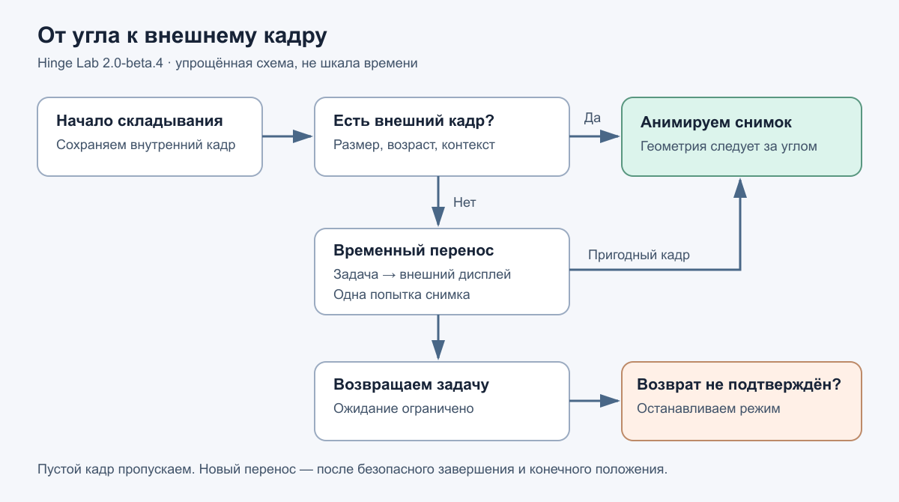

# Hinge Lab · 2.0-beta.15

Экспериментальная анимация сгиба поверх Android-приложений и лаборатория для исследования угла шарнира и переходов между дисплеями Samsung Fold. Работает без root; выбранные обои не заменяет.

**Статус:** выбранный финал исследования, не универсальная системная анимация. Мигание остаётся. На некоторых экранах WhatsApp, Госуслуг и других приложений внешняя часть эффекта может отсутствовать. Проверено на Samsung SM-F971B / Android 17; совместимость с другими прошивками и расход батареи отдельно не подтверждены.

[Канал «Посмотрим на практике»](https://t.me/pnplab) · [Чат сообщества](https://t.me/pnplab_chat).

[Тема на 4PDA: APK, настройка и обсуждение](https://4pda.to/forum/index.php?showtopic=1127046).

**История исследования на Хабре:** [Анимация iPhone Duo на Galaxy Fold: от красивой демки до работающего приложения](https://habr.com/ru/articles/1087304/). Гипотезы, эксперименты, устройство анимации и оставшиеся ограничения.

## Видео на реальном устройстве


Раскрытие, складывание и повторный переход на Samsung Fold. Запись без ускорения и вырезания системного мигания; выше — GIF-превью. [Видео MP4 в полном качестве](https://github.com/Dasojj/HingeLab/raw/refs/heads/main/docs/assets/hingelab-real-fold-demo.mp4).

## Два раздела

- **Анимация:** настройка телефона, запуск помощника и большая кнопка постоянного включения эффекта. Остановка доступна в приложении и уведомлении.
- **Выбор отрисовки:** текущий стиль остаётся по умолчанию. «Перспектива + блюр» — эксперимент с отдельной геометрией кадра, чёрной областью за его границами и равномерным размытием изображения. Выбор применяется при следующем создании анимации; получение угла и переключение дисплеев не меняются.
- **Лаборатория:** измерения, диагностические проверки, исторические варианты. Архивные режимы могут нарушить обычное переключение дисплеев; при зависании может потребоваться перезагрузка. Начинайте с пользовательской анимации.



Схема алгоритма; это не скриншот интерфейса и не обещание отсутствия системного мигания.

## Установка и запуск

**Важно:** перед запуском помощника включите «Отладка по USB» в параметрах разработчика и оставляйте её включённой во время использования анимации. Кабель и компьютер не нужны. На проверенном телефоне без этого помощник завершается после автоматического отключения Wi-Fi-отладки. Подтверждайте доступ по USB только для своих компьютеров.

1. Установите APK, откройте «Анимация» → «Подготовить телефон» и выполните шаги на экране.
2. Запустите «Запустить помощник · автоматически». Настройка использует сопряжение Wi-Fi ADB на самом телефоне. На подсвеченной строке настроек может понадобиться ручной клик. После успешного запуска Wi-Fi-отладка выключается.
3. Включите отдельную службу «Hinge Lab — анимация поверх приложений» и разрешите уведомления для кнопки остановки. Служба настройки помощника и служба анимации — разные службы.
4. Нажмите «Включить анимацию». Основной режим работает без общего 60-секундного таймера. Для первого прогона используйте приложение без несохранённых данных и один медленный цикл.
5. После обновления APK перезапустите shell-помощник. После перезагрузки телефона помощник тоже нужно запустить заново.

Если Android блокирует включение специальных возможностей для установленного APK, проверьте пункт разрешения ограниченных настроек в системной карточке приложения. Название и доступность зависят от прошивки.

## Что делает анимация

Источник подробного угла — штатный FoldInteractive. Раннее состояние TENT помогает начать переход из сложенного положения. Во время перехода запрашивается двухэкранный режим; в конечных положениях основной режим освобождает запрос. На передаче используется краткое удержание питания 700 мс.

Эффект рисует снимки, а не непрерывное видео приложения. Подходящий внешний кадр имеет приоритет. При его отсутствии во время складывания shell-помощник пробует временно перенести обычную задачу на внешний дисплей для снимка и вернуть обратно. Это зависит от поведения конкретного приложения. Если нет пригодного изображения, эффект пропускается; защищённый контент не обходится.

Исходники: [управление переходом](app/src/main/java/dev/duohome/hingelab/AdaptiveDisplaySession.java), [перенос задачи](app/src/main/java/dev/duohome/hingelab/TaskTransferProbe.java), [служба анимации](app/src/main/java/dev/duohome/hingelab/EverywhereAnimationService.kt).

## Доступы и данные

- **Специальные возможности для настройки:** помогают пройти видимые системные экраны сопряжения.
- **Специальные возможности для анимации:** снимают кадры и показывают окна поверх приложений; получение дерева содержимого окон для этой службы отключено.
- **Shell-помощник:** работает с правами ADB shell, получает данные источника и управляет временными переходами. Это существенный доступ, а не обычная декоративная тема.
- **WRITE_SECURE_SETTINGS:** может выдаваться при настройке для управления Wi-Fi-отладкой. **READ_LOGS** сохранён для исторических способов; основной источник обслуживается shell-помощником.
- **Сеть:** используется локальным ADB, сопряжением и обнаружением. Кадры не отправляются внешним серверам.

Основной кэш держит не более двух кадров с проверкой возраста до 10 секунд и контекста; при рисовании возможны временные копии. Снимки не записываются в файлы. Это ограничение числа кадров, не обещание нулевого расхода RAM. [Подробнее](docs/PRIVACY.md).

## Остановка и удаление

Перед удалением остановите анимацию, затем в блоке «Как работает и что важно знать» остановите помощник и измерения. Отдельный shell-процесс не следует считать автоматически завершённым при удалении APK. После перезагрузки он не запускается сам.

Если доступна кнопка остановки — используйте её. Если эксперимент оставил дисплеи или управление в нерабочем состоянии и остановить его невозможно, перезагрузите телефон. Не запускайте одновременно несколько утилит управления складными дисплеями.

## Что проверено

- Исправлено снятие анимации Google Сообщений после ложного события домашнего экрана.
- Исправлено блокирование следующего переноса после отказа до перемещения задачи.
- Проходят 58 unit-тестов логики; аппаратную совместимость они не гарантируют.
- Системное мигание и пустые внешние кадры отдельных приложений остаются. Медленные паузы и быстрые жесты могут завершать/пропускать эффект.

[Шаблон воспроизведения](docs/BUG_REPORT.md).

## Сборка

JDK 17+, Android SDK Platform 37, Gradle Wrapper 8.13. AGP 8.13.2, Kotlin 2.4.0. Сетевой доступ нужен для зависимостей. Путь SDK укажите через `ANDROID_HOME` или локальный `local.properties`.

```sh
./gradlew testDebugUnitTest assembleDebug
```

На Windows используйте `gradlew.bat`. APK: `app/build/outputs/apk/debug/app-debug.apk`.

Выбранный APK — debug-сборка с существующей подписью. Собственная сборка обычно подписана другим локальным ключом и не установится поверх неё. Не публикуйте ключи. Смена подписи требует отдельного плана обновления; удаление сбрасывает данные и доступы. USB-bootstrap использует `run-as`; автоматический Wi-Fi-bootstrap передаёт ключ другим путём. Простое переключение на release пока не проверено.

## Лицензии и публикация

Атрибуция ZFoldDuo сохранена: [MIT](app/src/main/assets/ZFoldDuo-MIT.txt), ревизия `c8da65d5f8bba036ddeb17b491e7e8fa3d6ab0b1`. Адаптированы метод источника и части модели/шейдера.

Собственный код Hinge Lab распространяется на условиях **GPL-3.0-only**: [LICENSE](LICENSE), [условия и сторонние компоненты](LICENSING.md). Сторонние компоненты сохраняют свои лицензии; SPAKE2-Java 1.1.1 распространяется под GPL-3.0. При публичной раздаче APK обеспечьте доступ к соответствующим исходникам и материалам сборки. [Сборка](BUILDING.md) · [Зависимости](third_party/DEPENDENCIES.md).
